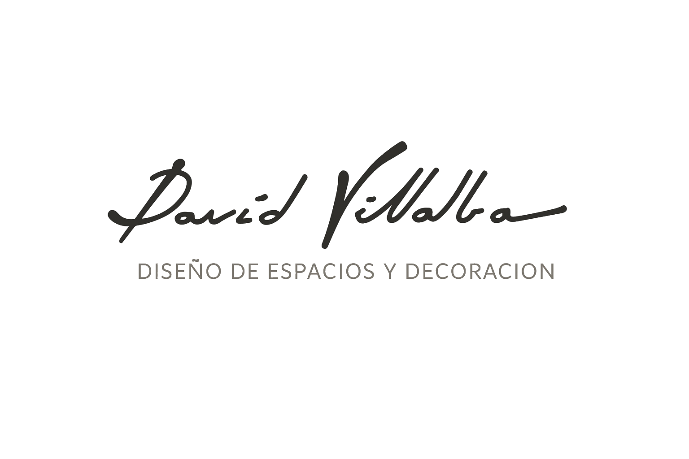

<div align="center">



# David Villalba — Decorador & Interiorista

**Estudio de Interiorismo en Utrera, Sevilla**

Sitio web profesional para el estudio de diseño de interiores David Villalba.  
Diseño elegante, moderno y totalmente responsive.

[](https://developer.mozilla.org/es/docs/Web/HTML)
[](https://developer.mozilla.org/es/docs/Web/CSS)
[](https://developer.mozilla.org/es/docs/Web/JavaScript)
[](LICENSE)

[Ver Web en Vivo](https://david-villalba.com) · [Contactar](https://wa.me/34646201038)

</div>

---

## 📋 Descripción

Página web corporativa para **David Villalba Decorador**, un estudio de interiorismo ubicado en Utrera (Sevilla). El sitio presenta el portafolio de proyectos realizados, los servicios ofrecidos, la filosofía de trabajo y un formulario de contacto integrado con WhatsApp.

> *"Quiero que mi equipo empiece en cada proyecto desde cero, sin inspirarse en nada en concreto, abierto a nuevas propuestas, siempre ávido por aprender y por incorporar nuevos materiales, nuevas técnicas, nuevas soluciones"*  
> — **David Villalba**

---

## ✨ Características

| | Característica | Detalle |
|:---:|---|---|
| 🎨 | **Diseño premium** | Estética sofisticada con tipografías serif (Cormorant Garamond) y sans-serif (Inter) |
| 📱 | **100% Responsive** | Adaptado a móvil, tablet y escritorio con menú hamburguesa |
| 🖼️ | **Hero con slider** | Carrusel de imágenes a pantalla completa con transiciones suaves |
| 📂 | **Galería de proyectos** | Grid de 12 proyectos con efecto hover overlay |
| 🔄 | **Navegación dinámica** | Navbar transparente que cambia al hacer scroll |
| 📞 | **Integración WhatsApp** | Botón flotante y enlace directo en la sección de contacto |
| ⚖️ | **Páginas legales** | Aviso legal y política de privacidad incluidos |
| 🔍 | **SEO optimizado** | Meta tags, Open Graph y estructura semántica HTML5 |
| 🎭 | **Animaciones** | Efectos de aparición al scroll (reveal) y microanimaciones CSS |

---

## 🗂️ Estructura del Proyecto

```
David-Villalba/
│
├── 📄 index.html                  # Página principal (SPA)
├── 📄 aviso-legal.html            # Aviso legal
├── 📄 politica-privacidad.html    # Política de privacidad
├── 🎨 styles.css                  # Estilos globales + variables CSS
├── ⚙️ script.js                   # Lógica, slider y animaciones
├── 📘 README.md
│
└── 📁 assets/
    └── 📁 img/
        ├── 📁 hero/               # Imágenes del carrusel hero
        ├── 📁 projects/           # Portadas de los proyectos
        ├── 📁 exposicion/         # Galería de la sala de exposición
        ├── 📁 estudio/            # Imágenes del estudio
        ├── 🖼️ logo.png            # Logo principal
        ├── 🖼️ logo-transparent.png # Logo fondo transparente
        └── 🖼️ favicon.png         # Favicon
```

---

## 🏗️ Secciones de la Web

| Sección | Descripción |
|:--------|:------------|
| **Hero** | Slider a pantalla completa con título animado y CTA |
| **Filosofía** | Presentación del estudio con cita del fundador |
| **Servicios** | Panel interactivo con pestañas (Residencial · Comercial · Llaves en Mano · Exposición) |
| **Proyectos** | Grid responsive de 12 proyectos con overlay hover |
| **Metodología** | Proceso de trabajo en 3 pasos: Contacto → Proyecto → Realidad |
| **Exposición** | Galería de la sala de exposición con contenido editorial |
| **Contacto** | Formulario, datos del estudio, mapa y enlace a WhatsApp |

---

## 🚀 Instalación y Uso

### Requisitos previos

No se requieren dependencias ni frameworks. El proyecto funciona con **HTML, CSS y JavaScript puros** (Vanilla).

### Ejecución local

```bash
# 1. Clonar el repositorio
git clone https://github.com/ELMURGA/David-Villalba.git
cd David-Villalba

# 2. Iniciar un servidor local (cualquiera de estas opciones)

# Con Python 3
python3 -m http.server 8080

# Con Node.js
npx serve .

# Con VS Code → Instalar extensión "Live Server" → clic en "Go Live"
```

Abrir en el navegador → `http://localhost:8080`

---

## 🎨 Personalización

### Paleta de colores

Los colores se definen como **variables CSS** en `styles.css` → `:root`:

```css
:root {
  --bg:           #FAF8F5;    /* Fondo principal — crema suave   */
  --text:         #2C2C2C;    /* Texto — gris oscuro             */
  --accent:       #8B7355;    /* Marrón dorado — botones, CTAs   */
  --accent-light: #A88B6A;    /* Marrón claro — hovers           */
  --white:        #FFFFFF;    /* Blanco puro                     */
}
```

### Logo

| Ubicación | Selector CSS | Propiedad |
|:----------|:-------------|:----------|
| Header (navbar) | `.navbar__logo-img` | `height: 100px` |
| Footer | `.footer__logo-img` | `height: 100px` |

### Tipografías

| Fuente | Uso | Fuente |
|:-------|:----|:-------|
| **Cormorant Garamond** | Títulos y encabezados | Google Fonts |
| **Inter** | Cuerpo de texto | Google Fonts |

---

## 🛠️ Stack Tecnológico

| Tecnología | Uso |
|:-----------|:----|
| **HTML5** | Estructura semántica y accesibilidad |
| **CSS3** | Estilos, animaciones, grid, flexbox, variables custom |
| **JavaScript ES6+** | Slider, scroll reveal, navegación dinámica, formularios |
| **Google Fonts** | Tipografías Cormorant Garamond + Inter |
| **SVG inline** | Iconos optimizados sin dependencias externas |

---

## 📱 Responsive Design

| Breakpoint | Dispositivo | Layout |
|:-----------|:------------|:-------|
| `≤ 768px` | 📱 Móvil | Menú hamburguesa, grid 1 columna |
| `≤ 1024px` | 📋 Tablet | Grid 2 columnas |
| `> 1024px` | 🖥️ Escritorio | Layout completo 3 columnas |

---

## 📧 Contacto

| | Dato |
|:---|:---|
| 🏢 | **David Villalba Decorador** |
| 📍 | La Fuente Vieja, Nº 6 — Utrera (Sevilla) |
| 📞 | [955 835 796](tel:+34955835796) · [620 147 446](tel:+34620147446) · [646 201 038](tel:+34646201038) |
| 📸 | [@davidvillalbadecorador](https://www.instagram.com/davidvillalbadecorador/) |
| 💬 | [WhatsApp Directo](https://wa.me/34646201038) |

---

## 📄 Licencia

Todos los derechos reservados © 2025 David Villalba Decorador.  
Este proyecto y su contenido (imágenes, textos, diseño) son propiedad exclusiva de David Villalba.

---

<div align="center">

**Hecho con ❤️ en Sevilla**

Desarrollado por [ELMURGA](https://github.com/ELMURGA)

</div>
